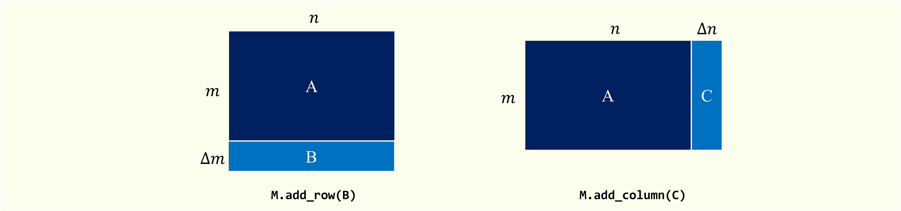
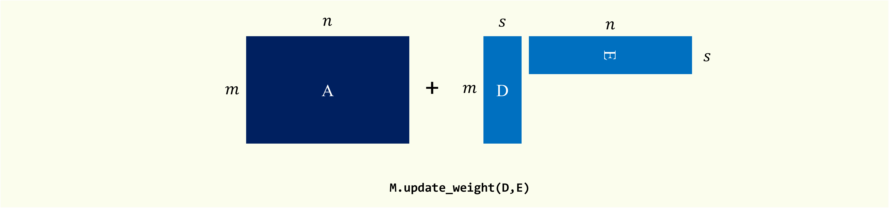

# IncSVD: A python package for dynamic Truncated SVD

[]()
[](https://arxiv.org/pdf/2401.09703.pdf)

**IncSVD** is a python package capable of dynamically maintaining the incremental Truncated Singular Value Decomposition (Truncated SVD) of evolving matrices.

This is the code implementation of the paper "Fast Updating Truncated SVD for Representation Learning with Sparse Matrices" (ICLR'24).

## Install and Setup.

It is recommended to use python 3.8 or higher and install **IncSVD** with the following command.

```shell
pip install IncSVD
```

## User Guide

Initialize the **IncSVD** using an $m \times n$ matrix `data_init` given the rank (dimension) `k` for which the truncated SVD needs to be computed. Here is an example to initialize a $1000 \times 1000$ matrix with truncated dimension $k = 64$.

***class EvolvingMatrix(data, k, sparse = True, method = "RPI")***
- **data: data matrix**
  Data matrix used to initialize truncated SVD.
  The format of this initial matrix can be `np.ndarray` or `scipy.sparse`.
- **k: *int***
  Truncated dimension in the maintained SVD.
  It should be a positive integer not greater than the length of the sides of the original matrix.
- **sparse: *bool, default=True*** 
  Set true implies the update process will employ the proposed acceleration methods [1].
  Set false implies using the original methods (ZhaSimon's [2], Vecharynski's [3], Yamazaki's [4]).
- **method: {'ZhaSimon', 'GKL', 'RPI'}, default='RPI'**
  Method for SVD update.
  It can be chosen from `['ZhaSimon', 'GKL', 'RPI']`. 


```python
import scipy.sparse
import IncSVD.EvolvingMatrix as EM
m, n, k = 1000, 1000, 64

# data_init = scipy.sparse.rand(m, n, density=0.005).tocsr()
M = EM.EvolvingMatrix(data_init, k, sparse=True, method="ZhaSimon")
```

> [!TIP]
>
> We recommend using `GKL` or `RPI` when the rank of each update matrix (e.g. adding many rows at once) is large.


### Row / Column Update

Expand the original matrix in row or column dimensions and update the corresponding SVD results.

<div style="text-align:center"> 
  
</div>

***add_row(update_matrix, l=None, t=None)***
- **update_matrix: data matrix**
  Data matrix to be appended. 
  This matrix should have the same number of **columns** as the original matrix. If type `sparse` is True, this matrix should be in `scipy.sparse._csr.csr_matrix`.
- **l: {*int, None*}**
  Approximate dimension for the update matrix.
  When using GKL or RPI, two methods that require an approximation space, it is necessary to set `l`. The update matrix of rank `s` will be approximated with a smaller space of rank `l` for further speedup. Set to `None` when GKL and RPI is not applied.
- **t: {*int, None*}**
  The number of iterations to perform in the random power iteration.
  It needs to be set when using the RPI. This approximation is more accurate when `t` is larger, while the computational overhead is larger. Set to `None` when RPI is not applied.

***add_column(update_matrix, l=None, t=None)***
- **update_matrix: data matrix**
  Data matrix to be appended. 
  This matrix should have the same number of **rows** as the original matrix. If type `sparse` is True, this matrix should be in `scipy.sparse._csc.csc_matrix`.
- **l: {*int, None*}**
  Approximate dimension for the update matrix.
  Set to `None` when GKL and RPI is not applied.
- **t: {*int, None*}**
  The number of iterations to perform in the random power iteration.
  Set to `None` when RPI is not applied.


```python
''' Add rows '''
# data_append_row = scipy.sparse.rand(m, 10, density=0.005).tocsr() * 10
M.add_row(data_append_row)

''' Add columns '''
# data_append_col = scipy.sparse.rand(n, 10, density=0.005).tocsc() * 10
M.add_column(data_append_col)
```


> [!NOTE]
>
> If type `sparse` is True.
>
> - [Add row] The input `data_append_row`  is required to have the same number of columns as the original matrix columns and be in `scipy.sparse._csr.csr_matrix` type.
> - [Add column] The input `data_append_col` is required to have the same number of rows as the original matrix rows and be in `scipy.sparse._csc.csc_matrix` type.

### Low-rank Update.

Perform low-rank update $\overline{\mathbf{A}} = \mathbf{A} + \mathbf{D}_m \cdot \mathbf{E}_m^{\top}$, where $\mathbf{A}$ is the original matrix, $\mathbf{D}_m \in \mathbb{R}^{m \times s}$ and $\mathbf{E}_m \in \mathbb{R}^{n \times s}$.

<div style="text-align:center"> 
  
</div>
***update_weight(self, update_matrix_B, update_matrix_C, l=None, t=None):***

- **update_matrix_B: data matrix**
  Data matrix to be appended. 
  This matrix should have the same number of **columns** as the original matrix. If type `sparse` is True, this matrix should be in `scipy.sparse._csc.csc_matrix`.
- **update_matrix_C: data matrix**
  Data matrix to be appended. 
  This matrix should have the same number of **columns** as the original matrix. If type `sparse` is True, this matrix should be in `scipy.sparse._csc.csc_matrix`.
- **l: {*int, None*}**
  Approximate dimension for the update matrix.
  Set to `None` when GKL and RPI is not applied.
- **t: {*int, None*}**
  The number of iterations to perform in the random power iteration. 
  Set to `None` when RPI is not applied.


```python
''' Low-rank update '''
# data_dm = scipy.sparse.rand(m, 10, density=0.005).tocsc() * 10
# data_em = scipy.sparse.rand(n, 10, density=0.005).tocsc() * 10
M.update_weight(data_dm, data_em)
```

> [!NOTE]
>
> If type `sparse` is True, the input `data_dm` and `data_em`  is required to be in `scipy.sparse._csc.csc_matrix` type.

### Get the result.

Queries the current SVD result.

```python
''' Get the result. '''
Uk, Sigmak, Vk = M.Uk, M.Sigmak, M.Vk

''' Get a row of singular vectors. '''
# i = 0
Uk0, Vk0 = M.Uki(i), M.Vki(i)

''' A low-rank approximation of data matrix can be obtained from. '''
Ak = Uk @ np.diag(Sigmak) @ Vk.T
```

## Contact Us    

If you have any questions about this code repository, feel free to `raise an issue` or email `denghaoran@zju.edu.cn`.


## Citations.

If you find our work useful, please consider citing the following paper:

```
@inproceedings{deng2024incsvd,
title={Fast Updating Truncated {SVD} for Representation Learning with Sparse Matrices},
author={Haoran Deng and Yang Yang and Jiahe Li and Cheng Chen and Weihao Jiang and Shiliang Pu},
booktitle={The Twelfth International Conference on Learning Representations},
year={2024},
url={https://openreview.net/forum?id=CX2RgsS29V}
}
```

